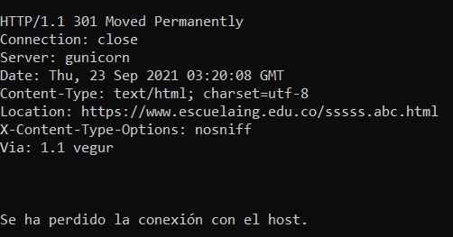
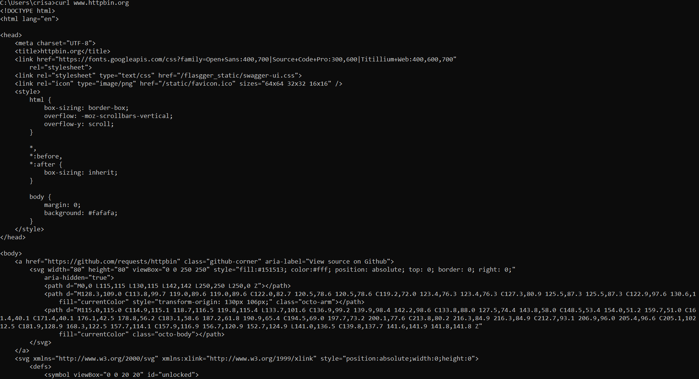

# LABORATORIO 5 - MVC PRIMEFACES INTRODUCTION - 2021-2
## INTEGRANTES  
- Cristian Andres Castellanos Fino
- Diego Alejandro Gonzalez Gualteros  
## PARTE I
### Protocolo Telnet  
  Para este punto hacemos uso del protocolo telnet con el _host_ ```www.escuelaing.edu.co``` _puerto_ ```80``` y el _recurso_ ```/sssss/abc.html```  
    
  En este caso se retorno el error _301 Moved Permanently_ es decir el archivo fue movido a otra dirección, como este exiten otro tipo de mensajes para dnotar distintos casos. Se dividen en un grupo de 5.  
  1. Respuestas informativas (100–199)
  2. Respuestas satisfactorias (200–299)
  3. Redirecciones (300–399)
  4. Errores de los clientes (400–499)
  5. Errores de los servidores (500–599)  

Ahora realizaremos una conexion telnet con el _host_ ```www.httpbin.org```, _puerto_ ```80``` y el _recurso_ ```/html```.  
  
Como resultado se obtuvo la informacion del request, como el mensaje enviado fue _200_ es decir correcto, se nos envio el recurso, el cual se denota en el codigo html.  

De la misma manera como podemos hacer un request con telnet, exite otro metodo que es con el comando ```curl```, este comando nos permite generar un requets a la direccion que le pidamos. Al hacer uso del comando, se ve que la peticion fue aceptada y nos envia el recurso.  
  
De la misma manera existen comandos para _curl_ como lo es ```-i```, en este caso se nos mostro ademas del recurso pedido, la informacion del request enviado, con su mensaje de respuesta, la longitud del archivo, entre otros.  
  
Si hacemos uso del comando ```-v``` se nos mostrara ademas de la misma informacion que con _-i_, una mayor cantidad de informacion como es la informacion de la peticion realizada.  
  
## PARTE II
### Servlet 
  Para este punto del laboratorio se genero un proyecto maven con el arquetipo web estandar de maven. Al compilar y empaquetar el proyecto, observamos que no se encuentra ningun tipo de error.  
  
  
  Modificamos el archivo ```pom.xml```para que tenga las dependencia necesarias para que nuestro servicio web corra, en este caso lo haremos por medio de _Tomcat_ por el puerto _8080_, una vez modificado el archivo pom, corremos le servicio por medio del comando ```mvn tomcat7:run```.  Nuevamente vemos que no se genera ningun tipo de erro.  
    
  Ahora para ver como funciona nuestro servidor web, abrimos en un navegador el url de nuestro archivo ```localhost:8080/helloServlet``` , en donde esta el puerto por el que nos comunicamos y el urlPatterns de la clase SampleServlet.  
    
  Vemos como funciona nuestro servidor, ahora por medio de la peticion Get, vamos a pedir a nuestro servidor web un saludo personalizado, dando parametros en la url, ```localhost:8080/helloServlet?name=Diego```.  
    
  
  Buscamos la dependencia _gson_ y la greagamos a nuestro archivo _pom_.  
    
  Probamos que haya sido instalado correctamente buscando en la direccion ```https://jsonplaceholder.typicode.com/todos/1``` y probando distintos valores al final del path.  
    
    
    la cual 
  
  Realizamos una aplicacion la cual nos retorne un mensaje de acuerdo al paramtro que se le envie, si el ```id``` es valido o no.  
    
  En este caso no se envio ningun parametro por lo cual se espera que mande una pagina que nos muestre un error.  
    
  En este caso se envia un ```id``` que no es valido, puesto que es un _String_, por lo cual se manda mensaje de error.  
    
  Para este caso se envia un ```id``` que no esta en el rango valido, por lo cual se envia un mensaje de error.  
    
  En este caso se envio un ```id``` valido, por lo cual se nos muestra una pequeña tabla.  
## PARTE III  
  Por medio de scripts nos es posible generar en la pagina creada un servicio que lea datos que ingrese el usuario, en este caso le pedimos a el susuario el ```id```.  
    
  Vemos que el usuario ingresa 1, al compararlo con la pagina de ActualServlet con ```id=1``` vemos que es igual a la pagina que fuimos enviados al enviar el id, en la caja de texto.  
    
    
  
  
  


